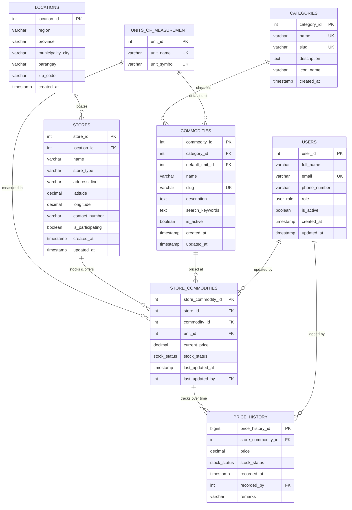

# Commodity Price Monitoring System — Database Schema & Data Dictionary

This document details the relational database design, data dictionary, entity relationships, and table schemas for the **Commodity Price Monitoring System**, built according to the functional requirements defined in [`readme.md`](./readme.md).

---

## 1. Entity-Relationship Diagram (ERD)

---

## 2. Enumerated Types (Enums)

### `user_role`
Defines authorization privileges and origin of reported prices.

| Value | Description |
|---|---|
| `citizen` | Public registered citizen reporting or monitoring prices. |
| `store_representative` | Authorized representative or manager of a participating store. |
| `market_inspector` | Local government / DTI / DA market monitoring officer. |
| `admin` | System administrator with full access to master catalogs and listings. |

### `stock_status`
Tracks live commodity availability at a specific store.

| Value | Description |
|---|---|
| `Available` | Commodity is in stock and currently purchasable at the listed price. |
| `Out of Stock` | Commodity is sold out or unavailable at the store. |
| `Limited` | Stock is running low or restricted per buyer. |

---

## 3. Database Tables Structure

### 3.1. `categories`
Organizes commodities into intuitive groups to power **Category-Based Browsing** and **Filtered Search**.

| Column Name | Data Type | Constraints | References | Description |
|---|---|---|---|---|
| `category_id` | `SERIAL` / `INT` | `PRIMARY KEY` | — | Unique auto-increment identifier for the category. |
| `name` | `VARCHAR(100)` | `NOT NULL`, `UNIQUE` | — | Display name (e.g. `Rice and Grains`, `Meat`, `Vegetables`). |
| `slug` | `VARCHAR(120)` | `NOT NULL`, `UNIQUE` | — | URL-friendly identifier (e.g. `rice-and-grains`, `meat`). |
| `description` | `TEXT` | `NULL` | — | Detailed summary of items grouped under this category. |
| `icon_name` | `VARCHAR(50)` | `NULL` | — | Icon symbol or SVG key used by client applications. |
| `created_at` | `TIMESTAMP WITH TIME ZONE`| `DEFAULT CURRENT_TIMESTAMP` | — | Timestamp of when category was created. |

---

### 3.2. `units_of_measurement`
Standardizes metric and counting units for fair price comparison across stores.

| Column Name | Data Type | Constraints | References | Description |
|---|---|---|---|---|
| `unit_id` | `SERIAL` / `INT` | `PRIMARY KEY` | — | Unique identifier for unit of measurement. |
| `unit_name` | `VARCHAR(50)` | `NOT NULL`, `UNIQUE` | — | Full unit name (e.g. `Kilogram`, `Liter`, `Piece`, `Dozen`). |
| `unit_symbol` | `VARCHAR(20)` | `NOT NULL`, `UNIQUE` | — | Standard unit abbreviation (e.g. `kg`, `L`, `pc`, `dz`, `pk`). |

---

### 3.3. `commodities`
Master registry of goods monitored across public markets, groceries, and sellers.

| Column Name | Data Type | Constraints | References | Description |
|---|---|---|---|---|
| `commodity_id` | `SERIAL` / `INT` | `PRIMARY KEY` | — | Unique identifier for the commodity. |
| `category_id` | `INT` | `NOT NULL` | `categories(category_id)` | Classification group the commodity belongs to. |
| `default_unit_id`| `INT` | `NOT NULL` | `units_of_measurement(unit_id)` | Baseline unit of measurement for comparative benchmarks. |
| `name` | `VARCHAR(150)` | `NOT NULL` | — | Common name of the good (e.g. `Regular Rice`, `Cooking Oil`). |
| `slug` | `VARCHAR(180)` | `NOT NULL`, `UNIQUE` | — | Web/API identifier (e.g. `regular-rice`, `cooking-oil`). |
| `description` | `TEXT` | `NULL` | — | Specification, grade, or notes regarding the item. |
| `search_keywords`| `TEXT` | `NULL` | — | Space/comma-delimited keywords, colloquial terms, aliases. |
| `is_active` | `BOOLEAN` | `DEFAULT TRUE`, `NOT NULL` | — | Flag indicating whether this commodity is actively tracked. |
| `created_at` | `TIMESTAMP WITH TIME ZONE`| `DEFAULT CURRENT_TIMESTAMP` | — | Record creation timestamp. |
| `updated_at` | `TIMESTAMP WITH TIME ZONE`| `DEFAULT CURRENT_TIMESTAMP` | — | Timestamp of last modification to commodity details. |

---

### 3.4. `locations`
Normalizes geographic jurisdictions to enable **Location-Based Price Information**.

| Column Name | Data Type | Constraints | References | Description |
|---|---|---|---|---|
| `location_id` | `SERIAL` / `INT` | `PRIMARY KEY` | — | Unique identifier for geographic location. |
| `region` | `VARCHAR(100)` | `NOT NULL` | — | Administrative region (e.g. `Region VIII`). |
| `province` | `VARCHAR(100)` | `NOT NULL` | — | Province name (e.g. `Samar`). |
| `municipality_city` | `VARCHAR(100)`| `NOT NULL` | — | City or municipality (e.g. `Calbayog City`). |
| `barangay` | `VARCHAR(100)` | `NOT NULL` | — | Specific barangay / district (e.g. `Capoocan`, `Obrero`). |
| `zip_code` | `VARCHAR(10)` | `NULL` | — | Postal ZIP code (e.g. `6710`). |
| `created_at` | `TIMESTAMP WITH TIME ZONE`| `DEFAULT CURRENT_TIMESTAMP` | — | Record creation timestamp. |

*Table Constraint*: `CONSTRAINT uq_location_entry UNIQUE (province, municipality_city, barangay)`

---

### 3.5. `stores`
Stores, public markets, groceries, supermarkets, and participating sellers.

| Column Name | Data Type | Constraints | References | Description |
|---|---|---|---|---|
| `store_id` | `SERIAL` / `INT` | `PRIMARY KEY` | — | Unique identifier for the store/market. |
| `location_id` | `INT` | `NOT NULL` | `locations(location_id)` | Geographical boundary containing the store. |
| `name` | `VARCHAR(150)` | `NOT NULL` | — | Store or public market name (e.g. `Market A`, `Store B`). |
| `store_type` | `VARCHAR(50)` | `DEFAULT 'Public Market'` | — | Classification (`Public Market`, `Grocery`, `Supermarket`). |
| `address_line` | `VARCHAR(255)` | `NOT NULL` | — | Street address, stall number, or landmark. |
| `latitude` | `DECIMAL(10, 8)` | `NULL` | — | GPS latitude coordinate for proximity searches. |
| `longitude` | `DECIMAL(11, 8)` | `NULL` | — | GPS longitude coordinate for proximity searches. |
| `contact_number`| `VARCHAR(30)` | `NULL` | — | Official store contact or vendor association number. |
| `is_participating`| `BOOLEAN` | `DEFAULT TRUE`, `NOT NULL` | — | Active status in the price monitoring program. |
| `created_at` | `TIMESTAMP WITH TIME ZONE`| `DEFAULT CURRENT_TIMESTAMP` | — | Store registration timestamp. |
| `updated_at` | `TIMESTAMP WITH TIME ZONE`| `DEFAULT CURRENT_TIMESTAMP` | — | Store update timestamp. |

---

### 3.6. `users`
Citizen price reporters, store representatives, price monitors, and system admins.

| Column Name | Data Type | Constraints | References | Description |
|---|---|---|---|---|
| `user_id` | `SERIAL` / `INT` | `PRIMARY KEY` | — | Unique user identifier. |
| `full_name` | `VARCHAR(120)` | `NOT NULL` | — | Full name of user or reporting agent. |
| `email` | `VARCHAR(150)` | `NOT NULL`, `UNIQUE` | — | Contact and authentication email. |
| `phone_number` | `VARCHAR(30)` | `NULL` | — | Contact mobile number. |
| `role` | `user_role` | `DEFAULT 'citizen'`, `NOT NULL`| — | User authorization tier (`citizen`, `market_inspector`, etc.). |
| `is_active` | `BOOLEAN` | `DEFAULT TRUE`, `NOT NULL` | — | Active account status. |
| `created_at` | `TIMESTAMP WITH TIME ZONE`| `DEFAULT CURRENT_TIMESTAMP` | — | Registration timestamp. |
| `updated_at` | `TIMESTAMP WITH TIME ZONE`| `DEFAULT CURRENT_TIMESTAMP` | — | Profile update timestamp. |

---

### 3.7. `store_commodities` (Live Offerings & Current Price)
Junction table joining `stores` and `commodities` (Many-to-Many). Stores the **current live price** and stock status for immediate, high-performance querying.

| Column Name | Data Type | Constraints | References | Description |
|---|---|---|---|---|
| `store_commodity_id` | `SERIAL` / `INT` | `PRIMARY KEY` | — | Unique identifier for a store's item offering. |
| `store_id` | `INT` | `NOT NULL` | `stores(store_id)` | Store selling the commodity. |
| `commodity_id` | `INT` | `NOT NULL` | `commodities(commodity_id)`| Monitored commodity being sold. |
| `unit_id` | `INT` | `NOT NULL` | `units_of_measurement(unit_id)`| Unit of sale used by this store. |
| `current_price` | `DECIMAL(10, 2)` | `NOT NULL`, `CHECK (current_price >= 0)` | — | Current price in Philippine Peso (₱). |
| `stock_status` | `stock_status` | `DEFAULT 'Available'`, `NOT NULL` | — | Real-time availability (`Available`, `Out of Stock`). |
| `last_updated_at` | `TIMESTAMP WITH TIME ZONE`| `DEFAULT CURRENT_TIMESTAMP` | — | Timestamp of most recent price verification. |
| `last_updated_by` | `INT` | `NULL` | `users(user_id)` | User or market inspector who verified this price. |

*Table Constraints*:
- `CONSTRAINT uq_store_commodity_unit UNIQUE (store_id, commodity_id, unit_id)`

---

### 3.8. `price_history`
Append-only time-series ledger recording all price changes over time. Powers **Price History & Trend Analysis**.

| Column Name | Data Type | Constraints | References | Description |
|---|---|---|---|---|
| `price_history_id` | `BIGSERIAL` | `PRIMARY KEY` | — | Unique auto-increment identifier for history entry. |
| `store_commodity_id`| `INT` | `NOT NULL` | `store_commodities(store_commodity_id)` | Offering whose price is being recorded. |
| `price` | `DECIMAL(10, 2)` | `NOT NULL`, `CHECK (price >= 0)` | — | Recorded price at that specific point in time. |
| `stock_status` | `stock_status` | `DEFAULT 'Available'`, `NOT NULL` | — | Stock status at time of observation. |
| `recorded_at` | `TIMESTAMP WITH TIME ZONE`| `DEFAULT CURRENT_TIMESTAMP` | — | Exact date and time the observation was made. |
| `recorded_by` | `INT` | `NULL` | `users(user_id)` | User / inspector who reported the price entry. |
| `remarks` | `VARCHAR(255)` | `NULL` | — | Notes (e.g. `Weekly price check`, `Fuel price hike`). |

---

## 4. Entity Connections & Relationships Matrix

| Relationship | Type | Parent Table | Child Table | Foreign Key Column | On Delete Action | Functional Purpose |
|---|---|---|---|---|---|---|
| **Category Classification** | `1 : N` | `categories` | `commodities` | `category_id` | `RESTRICT` | Organizes items under categories (e.g. *Rice and Grains*). |
| **Commodity Default Unit** | `1 : N` | `units_of_measurement` | `commodities` | `default_unit_id` | `RESTRICT` | Standard baseline unit for comparing commodities. |
| **Store Geographic Location**| `1 : N` | `locations` | `stores` | `location_id` | `RESTRICT` | Pinpoints store location by Barangay & Municipality. |
| **Store Inventory Offering** | `1 : N` | `stores` | `store_commodities` | `store_id` | `CASCADE` | Connects a store to all the products it carries. |
| **Commodity Store Listing** | `1 : N` | `commodities` | `store_commodities` | `commodity_id` | `CASCADE` | Connects a product to all sellers offering it. |
| **Store Unit of Sale** | `1 : N` | `units_of_measurement` | `store_commodities` | `unit_id` | `RESTRICT` | Preserves the unit used for pricing at that specific store. |
| **Price Log Evolution** | `1 : N` | `store_commodities` | `price_history` | `store_commodity_id` | `CASCADE` | Records price evolution and trends over time. |
| **Price Auditor (Live)** | `1 : N` | `users` | `store_commodities` | `last_updated_by` | `SET NULL` | Tracks who verified the latest active price. |
| **Price Auditor (History)** | `1 : N` | `users` | `price_history` | `recorded_by` | `SET NULL` | Preserves who logged historical observations. |

---

## 5. Performance Indexes

| Index Name | Target Table | Indexed Columns | Optimization Target |
|---|---|---|---|
| `idx_locations_municipality_city` | `locations` | `municipality_city` | Speed up searches for cities (e.g. *Calbayog City*). |
| `idx_stores_location_id` | `stores` | `location_id` | Quick join between stores and geographic areas. |
| `idx_commodities_category_id` | `commodities` | `category_id` | Instant retrieval for Category-Based Browsing. |
| `idx_commodities_name` | `commodities` | `name` | Quick auto-complete search as user types commodity name. |
| `idx_store_commodities_commodity_price`| `store_commodities`| `(commodity_id, current_price)` | Fast price comparison & sorting from cheapest to highest. |
| `idx_store_commodities_store_id` | `store_commodities`| `store_id` | Fast store catalogue loading. |
| `idx_price_history_lookup` | `price_history` | `(store_commodity_id, recorded_at DESC)`| Rapid generation of daily, weekly, and monthly trend charts. |

---

## 6. How the Schema Powers README Core Functionalities

| README Requirement | Tables Involved | How the Connection Operates |
|---|---|---|
| **1. Commodity Price Viewing** | `commodities`, `store_commodities`, `units_of_measurement`, `stores`, `locations` | Joins item details with store location, unit, current price, and `last_updated_at`. |
| **2. Commodity Search** | `commodities`, `categories` | Searches across `name`, `slug`, and `search_keywords`, optionally constrained by `category_id`. |
| **3. Price Comparison** | `store_commodities`, `stores`, `commodities`, `units_of_measurement` | Filters by `commodity_id`, joins participating `stores`, and sorts by `current_price ASC` to highlight the cheapest option. |
| **4. Category Browsing** | `categories`, `commodities`, `store_commodities` | Queries commodities with a given `category_id` or `slug`, counting active sellers. |
| **5. Location-Based Information** | `locations`, `stores`, `store_commodities`, `commodities` | Filters `locations.municipality_city = 'Calbayog City'` and resolves nearby stores and prices. |
| **6. Price History and Trends** | `store_commodities`, `price_history` | Queries `price_history` ordered by `recorded_at ASC` to calculate increases/decreases (`price - LAG(price)`) and render trend charts. |

