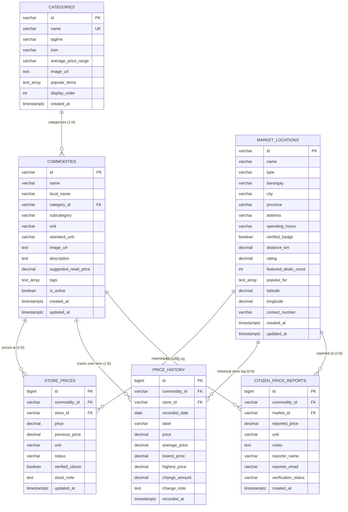

# SUKI — Smart Utility & Kalakal Information | Database Schema & Data Dictionary

This document details the production relational database schema (PostgreSQL & Supabase), entity-relationship diagram (ERD), data dictionary, and API architecture for the **SUKI Commodity Price Monitoring System**.

This schema correlates **1:1 with the website frontend data structures** defined in [`src/types/index.ts`](./src/types/index.ts), [`src/data/mockData.ts`](./src/data/mockData.ts), and the production UI components in the application.

---

## 1. Entity-Relationship Diagram (ERD)

---

## 2. Table Specifications & Data Dictionaries

### 2.1. `categories` Table
Correlates with the `Category` TypeScript interface and powers `CategoriesView.tsx`.

| Column Name | Data Type | Constraints | References | Frontend Mapping | Description |
|---|---|---|---|---|---|
| `id` | `VARCHAR(50)` | `PRIMARY KEY` | — | `category.id` | Slug identifier (e.g. `rice-grains`, `meat-poultry`, `fish-seafood`). |
| `name` | `VARCHAR(100)` | `NOT NULL`, `UNIQUE` | — | `category.name` | Display title (e.g. `Rice & Grains`, `Cooking Essentials`). |
| `tagline` | `VARCHAR(255)` | `NOT NULL` | — | `category.tagline` | Editorial subheading summarizing the category goods. |
| `icon` | `VARCHAR(50)` | `NOT NULL` | — | `category.icon` | Lucide icon identifier (e.g. `Wheat`, `Drumstick`, `Fish`, `Egg`). |
| `average_price_range`| `VARCHAR(50)` | `NULL` | — | `category.averagePriceRange` | Price interval label (e.g. `₱42.00 - ₱62.00 / kg`). |
| `image_url` | `TEXT` | `NOT NULL` | — | `category.image` | High-resolution category backdrop image URL. |
| `popular_items` | `TEXT[]` | `DEFAULT '{}'` | — | `category.popularItems` | Array of popular item names under the category. |
| `display_order` | `INT` | `DEFAULT 0` | — | — | Sort order for display in tabs and category grids. |
| `created_at` | `TIMESTAMPTZ` | `DEFAULT CURRENT_TIMESTAMP` | — | — | Record creation timestamp. |

---

### 2.2. `market_locations` Table
Correlates with the `MarketLocation` TypeScript interface and powers `LocationsView.tsx`.

| Column Name | Data Type | Constraints | References | Frontend Mapping | Description |
|---|---|---|---|---|---|
| `id` | `VARCHAR(50)` | `PRIMARY KEY` | — | `location.id` | Market ID (e.g. `mkt-calbayog-central`, `mkt-rawis-talipapa`). |
| `name` | `VARCHAR(150)`| `NOT NULL` | — | `location.name` | Full market name (e.g. `Calbayog Central Public Market`). |
| `type` | `VARCHAR(50)` | `NOT NULL`, `CHECK (type IN (...))` | — | `location.type` | Enum: `Public Wet Market`, `Supermarket`, `Grocery Store`, `Farmers Market`, `Barangay Talipapa`. |
| `barangay` | `VARCHAR(100)`| `NOT NULL` | — | `location.barangay` | Barangay district (e.g. `Brgy. Central`, `Brgy. Rawis`). |
| `city` | `VARCHAR(100)`| `DEFAULT 'Calbayog City'` | — | `location.city` | City / Municipality. |
| `province` | `VARCHAR(100)`| `DEFAULT 'Samar'` | — | — | Province name. |
| `address` | `VARCHAR(255)`| `NOT NULL` | — | `location.address` | Street address or landmark. |
| `operating_hours`| `VARCHAR(100)`| `NOT NULL` | — | `location.operatingHours`| Schedule (e.g. `4:00 AM - 7:30 PM (Daily)`). |
| `verified_badge`| `BOOLEAN` | `DEFAULT TRUE` | — | `location.verifiedBadge` | Verified government / community inspection badge. |
| `distance_km` | `DECIMAL(4,1)`| `DEFAULT 0.0` | — | `location.distanceKm` | Distance from central reference point in kilometers. |
| `rating` | `DECIMAL(2,1)`| `DEFAULT 4.5` | — | `location.rating` | Citizen feedback score (e.g. `4.8`). |
| `featured_deals_count` | `INT` | `DEFAULT 0` | — | `location.featuredDealsCount` | Number of promotional prices recorded. |
| `popular_for` | `TEXT[]` | `DEFAULT '{}'` | — | `location.popularFor` | Array of signature specialties (e.g. `['Fresh Seafood']`). |
| `latitude` | `DECIMAL(10,8)`| `NULL` | — | — | GPS coordinate latitude. |
| `longitude`| `DECIMAL(11,8)`| `NULL` | — | — | GPS coordinate longitude. |
| `created_at`| `TIMESTAMPTZ` | `DEFAULT CURRENT_TIMESTAMP` | — | — | Record creation timestamp. |
| `updated_at`| `TIMESTAMPTZ` | `DEFAULT CURRENT_TIMESTAMP` | — | — | Record update timestamp. |

---

### 2.3. `commodities` Table
Correlates with the master catalog attributes of `Commodity` in `src/types/index.ts`.

| Column Name | Data Type | Constraints | References | Frontend Mapping | Description |
|---|---|---|---|---|---|
| `id` | `VARCHAR(50)` | `PRIMARY KEY` | — | `commodity.id` | Unique ID (e.g. `cmd-rice-regular`, `cmd-chicken-whole`). |
| `name` | `VARCHAR(150)`| `NOT NULL` | — | `commodity.name` | Standard item name (e.g. `Regular Milled Rice`). |
| `local_name` | `VARCHAR(150)`| `NULL` | — | `commodity.localName` | Colloquial / local vernacular (e.g. `Regular Rice (NFA / Local Harvest)`). |
| `category_id` | `VARCHAR(50)` | `NOT NULL` | `categories(id)` | `commodity.category` | Foreign key referencing category slug. |
| `subcategory` | `VARCHAR(100)`| `NOT NULL` | — | `commodity.subcategory` | Finer grouping (e.g. `Milled Rice`, `Poultry`, `Sweeteners`). |
| `unit` | `VARCHAR(30)` | `NOT NULL` | — | `commodity.unit` | Unit token (`kg`, `piece`, `liter`, `can`, `tray`, `pack`). |
| `standard_unit`| `VARCHAR(50)` | `NOT NULL` | — | `commodity.standardUnit` | Friendly unit label (e.g. `1 kg`, `1 piece`, `1 tray (30 eggs)`). |
| `image_url` | `TEXT` | `NOT NULL` | — | `commodity.image` | High-quality image URL. |
| `description` | `TEXT` | `NOT NULL` | — | `commodity.description` | Detailed nutritional and market description. |
| `suggested_retail_price` | `DECIMAL(10,2)`| `NULL` | — | `commodity.suggestedRetailPrice`| Official SRP issued by DTI / Department of Agriculture. |
| `tags` | `TEXT[]` | `DEFAULT '{}'` | — | `commodity.tags` | Search tags (`['Staple', 'Popular', 'Monitored']`). |
| `is_active` | `BOOLEAN` | `DEFAULT TRUE` | — | — | Flag to hide unmonitored goods. |
| `created_at` | `TIMESTAMPTZ` | `DEFAULT CURRENT_TIMESTAMP` | — | — | Record creation timestamp. |
| `updated_at` | `TIMESTAMPTZ` | `DEFAULT CURRENT_TIMESTAMP` | — | — | Record update timestamp. |

---

### 2.4. `store_prices` Table (Live Listings & Comparisons)
Correlates with `StorePrice` in `src/types/index.ts` and powers `CompareView.tsx` and `BasketCalculatorView.tsx`.

| Column Name | Data Type | Constraints | References | Frontend Mapping | Description |
|---|---|---|---|---|---|
| `id` | `BIGSERIAL` | `PRIMARY KEY` | — | — | Unique row sequence. |
| `commodity_id` | `VARCHAR(50)` | `NOT NULL` | `commodities(id)` | `storePrice.commodityId` | Commodity being priced. |
| `store_id` | `VARCHAR(50)` | `NOT NULL` | `market_locations(id)` | `storePrice.storeId` | Market or grocery offering the commodity. |
| `price` | `DECIMAL(10,2)`| `NOT NULL`, `CHECK (price >= 0)` | — | `storePrice.price` | Current verified price in ₱. |
| `previous_price`| `DECIMAL(10,2)`| `NULL` | — | `storePrice.previousPrice` | Price during previous verification (for change tracking). |
| `unit` | `VARCHAR(30)` | `NOT NULL` | — | `storePrice.unit` | Unit of measure sold at this stall/market. |
| `status` | `VARCHAR(20)` | `DEFAULT 'available'`, `CHECK (...)` | — | `storePrice.status` | State: `available`, `out_of_stock`, `low_stock`. |
| `verified_citizen`| `BOOLEAN` | `DEFAULT TRUE` | — | `storePrice.verifiedCitizen` | Citizen or inspector verification marker. |
| `stock_note` | `TEXT` | `NULL` | — | `storePrice.stockNote` | Remarks (e.g. `Full sacks available`, `Mindanao harvest`). |
| `updated_at` | `TIMESTAMPTZ` | `DEFAULT CURRENT_TIMESTAMP` | — | `storePrice.updatedAt` | Verification timestamp. |

*Unique Constraint*: `UNIQUE (commodity_id, store_id, unit)`

---

### 2.5. `price_history` Table (Longitudinal Trend Analysis)
Correlates with `PriceHistoryPoint` in `src/types/index.ts` and powers `TrendsView.tsx` and `PriceSparkline.tsx`.

| Column Name | Data Type | Constraints | References | Frontend Mapping | Description |
|---|---|---|---|---|---|
| `id` | `BIGSERIAL` | `PRIMARY KEY` | — | — | Unique record sequence. |
| `commodity_id` | `VARCHAR(50)` | `NOT NULL` | `commodities(id)` | — | Monitored commodity. |
| `store_id` | `VARCHAR(50)` | `NULL` | `market_locations(id)` | — | Specific market (or `NULL` for city-wide average). |
| `recorded_date` | `DATE` | `NOT NULL` | — | `point.date` | Date of recorded observation (`YYYY-MM-DD`). |
| `label` | `VARCHAR(50)` | `NOT NULL` | — | `point.label` | Chart point label (e.g. `Day 1`, `Week 2`, `Oct 01`). |
| `price` | `DECIMAL(10,2)`| `NOT NULL`, `CHECK (price >= 0)` | — | `point.price` | Observed price at this timestamp. |
| `average_price` | `DECIMAL(10,2)`| `NULL` | — | `point.averagePrice` | City-wide average on this date. |
| `lowest_price` | `DECIMAL(10,2)`| `NULL` | — | `point.lowestPrice` | Lowest recorded price across all markets on this date. |
| `highest_price`| `DECIMAL(10,2)`| `NULL` | — | `point.highestPrice` | Highest recorded price across all markets on this date. |
| `change_amount`| `DECIMAL(10,2)`| `NULL` | — | `point.changeAmount` | Delta from previous observation point. |
| `change_note` | `TEXT` | `NULL` | — | `point.changeNote` | Reason for movement (e.g. `Fuel price hike`, `New harvest`). |
| `recorded_at` | `TIMESTAMPTZ` | `DEFAULT CURRENT_TIMESTAMP` | — | — | Exact logging timestamp. |

---

### 2.6. `citizen_price_reports` Table (Crowdsourcing)
Correlates with the form submission in `ReportPriceModal.tsx`.

| Column Name | Data Type | Constraints | References | Description |
|---|---|---|---|---|
| `id` | `BIGSERIAL` | `PRIMARY KEY` | — | Unique report identifier. |
| `commodity_id` | `VARCHAR(50)` | `NOT NULL` | `commodities(id)` | Commodity reported by the citizen. |
| `market_id` | `VARCHAR(50)` | `NOT NULL` | `market_locations(id)` | Market or store where the citizen observed the price. |
| `reported_price`| `DECIMAL(10,2)`| `NOT NULL`, `CHECK (reported_price > 0)` | — | Observed price (₱). |
| `unit` | `VARCHAR(30)` | `NOT NULL` | — | Unit observed (`kg`, `piece`, `liter`, etc.). |
| `notes` | `TEXT` | `NULL` | — | Stall number, brand, or quality remarks. |
| `reporter_name`| `VARCHAR(120)`| `DEFAULT 'Citizen Contributor'` | — | Optional name of contributor. |
| `reporter_email`| `VARCHAR(150)`| `NULL` | — | Contributor email for verification. |
| `verification_status`| `VARCHAR(20)` | `DEFAULT 'pending'` | — | Status: `pending`, `verified`, `rejected`. |
| `created_at` | `TIMESTAMPTZ` | `DEFAULT CURRENT_TIMESTAMP` | — | Submission timestamp. |

---

## 3. Relational Connections & Cardinality Matrix

| Relationship | Type | Parent Entity | Child Entity | Foreign Key Column | On Delete Action | Frontend Functionality Powered |
|---|---|---|---|---|---|---|
| **Category Grouping** | `1 : N` | `categories` | `commodities` | `category_id` | `RESTRICT` | Category filtering in `CatalogView` and `CategoriesView`. |
| **Market Offering** | `1 : N` | `market_locations` | `store_prices` | `store_id` | `CASCADE` | Store inventory display in `LocationsView`. |
| **Product Multi-Store Pricing** | `1 : N` | `commodities` | `store_prices` | `commodity_id` | `CASCADE` | Cross-store comparison in `CompareView`. |
| **Price Trend Tracking** | `1 : N` | `commodities` | `price_history` | `commodity_id` | `CASCADE` | 30-day SVG trajectory charts in `TrendsView`. |
| **Store History Association**| `0 : N` | `market_locations` | `price_history` | `store_id` | `SET NULL` | Store-specific historical price analytics. |
| **Citizen Product Report** | `1 : N` | `commodities` | `citizen_price_reports` | `commodity_id` | `CASCADE` | Crowdsourced item contribution in `ReportPriceModal`. |
| **Citizen Store Report** | `1 : N` | `market_locations` | `citizen_price_reports` | `market_id` | `CASCADE` | Crowdsourced location contribution in `ReportPriceModal`. |

---

## 4. Supabase API Service Architecture

A clean, strongly-typed Supabase API client is implemented in:
👉 [`src/services/supabase.ts`](./src/services/supabase.ts)

### Methods Implemented:
- `SukiApi.getCategories()`: Fetches all categories with active commodity counts.
- `SukiApi.getMarketLocations(options)`: Fetches markets with distance, ratings, and operating hours.
- `SukiApi.getCommodities(options)`: Fetches commodities with pre-calculated cheapest price, store comparisons, and 30-day historical points.
- `SukiApi.getCommodityById(id)`: Fetches single commodity details.
- `SukiApi.reportPrice(report)`: Inserts crowdsourced reports into `citizen_price_reports`.
- `SukiApi.subscribeToPriceUpdates(callback)`: Real-time Supabase postgres channel for live price updates.

> **Note on Deployment & Integration**: The API service and schema files are created outside `dist/` and are ready for integration without modifying the currently built files in `dist/`.
